<div align="center">

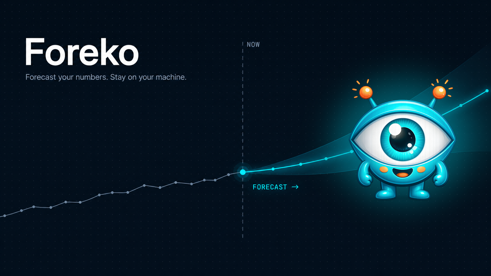

<br/>

[](LICENSE)
[](https://www.python.org/)
[](https://nodejs.org/)
[](https://fastapi.tiangolo.com/)
[](https://react.dev/)
[](https://github.com/google-research/timesfm)
[](https://developer.nvidia.com/cuda-zone)

<br/>

<a href="https://github.com/MinaSaad1/Foreko/releases/latest"></a>
&nbsp;&nbsp;
<a href="#install"></a>

<br/>
<br/>

<a href="#install"><b>Install</b></a> &nbsp;·&nbsp; <a href="#the-pages"><b>Screenshots</b></a> &nbsp;·&nbsp; <a href="#the-models"><b>Models</b></a> &nbsp;·&nbsp; <a href="#architecture"><b>Architecture</b></a> &nbsp;·&nbsp; <a href="#faq"><b>FAQ</b></a>

<br/>

A free, local-first forecasting workbench. Point it at a CSV and get a trustworthy
forecast with uncertainty bands, a recommended model, and plain-English diagnostics.

</div>

<br/>

<p align="center">
  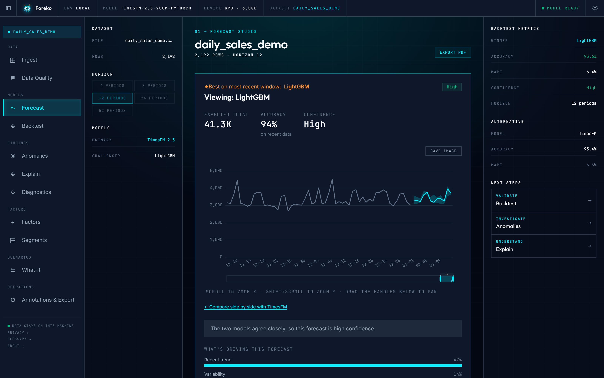
</p>

<br/>

<table>
<tr>
<td width="50%" valign="top">

### Local-first

Your data never leaves your machine. No accounts, no telemetry, no cloud.
The only outbound request is the one-time TimesFM weights download.

</td>
<td width="50%" valign="top">

### Two models, one click

Google's TimesFM foundation model and a LightGBM baseline run side by
side, backtested on your data. Foreko shows the winner and the runner-up.

</td>
</tr>
<tr>
<td width="50%" valign="top">

### Honest uncertainty

P10 / P50 / P90 bands, walk-forward backtests across multiple folds,
prediction-interval calibration. Every confidence claim is measurable.

</td>
<td width="50%" valign="top">

### Apache 2.0, forever free

No paid tier, no upsell, no commercial gating. The whole app is in this
repo, under a permissive Apache 2.0 license.

</td>
</tr>
</table>

<br/>

---

<div align="center">

## The flow

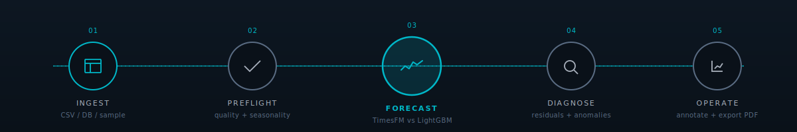

</div>

---

## Install

Two ways to run Foreko. Both stay entirely on your machine.

### Windows installer (easiest)

Download the latest **`.exe`** installer from the
[**Releases page**](https://github.com/MinaSaad1/Foreko/releases/latest),
run it, then launch Foreko from the Start menu. No Python, no Node, no
command line. The installer bundles the backend and opens the app in
your browser.

### Run from source (any OS)

```bash
# 1. Clone
git clone https://github.com/MinaSaad1/Foreko.git && cd Foreko

# 2. Install (auto-detects NVIDIA GPU + CUDA driver)
./setup.ps1            # Windows
./setup.sh             # Linux / macOS

# 3. Run, two terminals
uv run uvicorn foreko.main:app --port 8000 --reload --app-dir app/backend
cd app/frontend && npm run dev
```

Then open **<http://localhost:5173>** and either upload a CSV or click
**Try demo dataset**.

> Whichever path you pick, the first forecast downloads TimesFM 2.5
> weights (~1.2 GB) into `~/.foreko/models/`. Cached after that.

---

## The pages

<table>
<tr>
<td width="33%" align="center" valign="top">

<a href="docs/screenshots/02-data.png">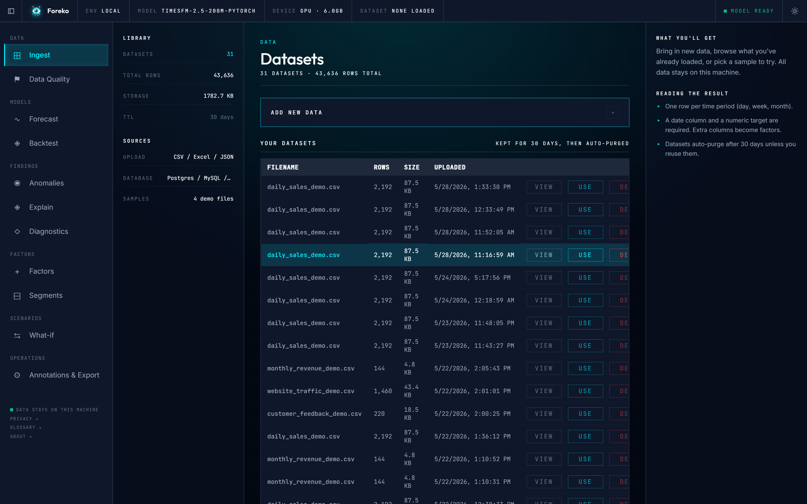</a>

**Data**
<br/>
<sub>CSV, Excel, JSON, or a live DB. Browse your library, pick a sample.</sub>

</td>
<td width="33%" align="center" valign="top">

<a href="docs/screenshots/03b-preflight-result.png">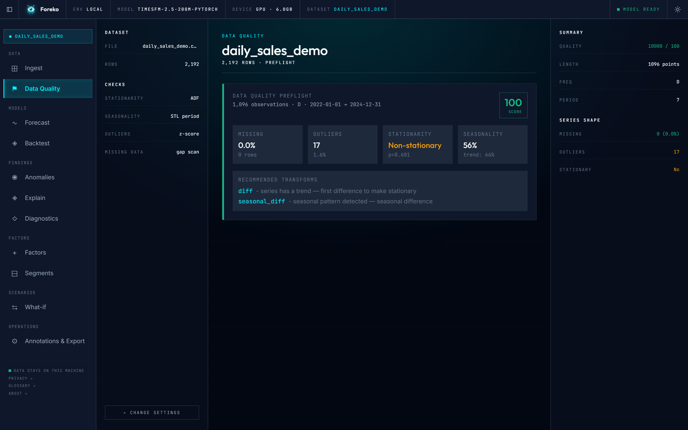</a>

**Preflight**
<br/>
<sub>Pre-forecast health check. ADF, STL, outliers, missing data, transforms.</sub>

</td>
<td width="33%" align="center" valign="top">

<a href="docs/screenshots/04b-forecast-result.png"></a>

**Forecast**
<br/>
<sub>TimesFM vs LightGBM side by side. Winner picked by holdout MAPE.</sub>

</td>
</tr>
<tr>
<td width="33%" align="center" valign="top">

<a href="docs/screenshots/05-backtest-config.png">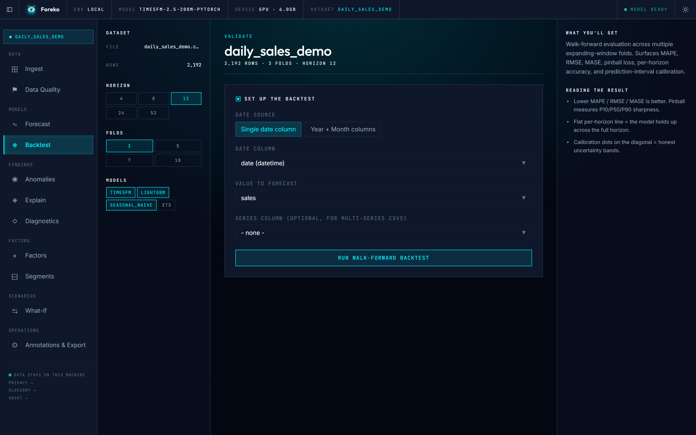</a>

**Backtest**
<br/>
<sub>Walk-forward across N folds. MAPE, RMSE, MASE, pinball, calibration.</sub>

</td>
<td width="33%" align="center" valign="top">

<a href="docs/screenshots/06b-diagnostics-result.png">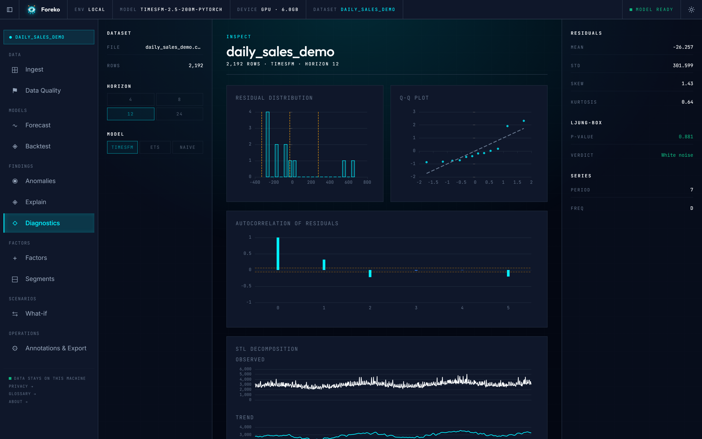</a>

**Diagnostics**
<br/>
<sub>Residual histogram, Q-Q, ACF, STL, Ljung-Box. White noise or not.</sub>

</td>
<td width="33%" align="center" valign="top">

<a href="docs/screenshots/07b-anomaly-result.png">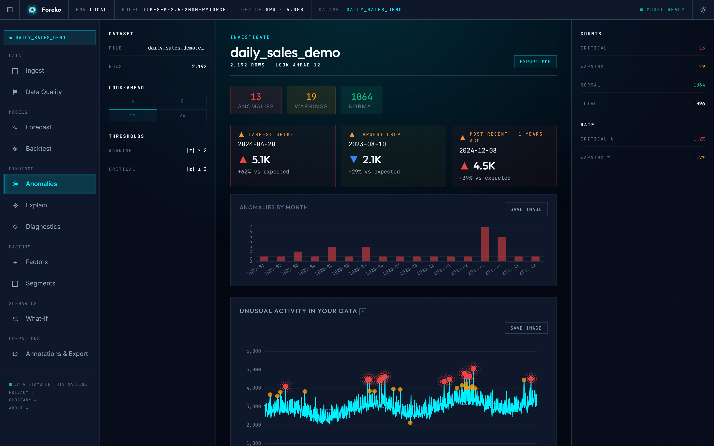</a>

**Anomalies**
<br/>
<sub>z-score severity, monthly heatmap, drillable table of flagged points.</sub>

</td>
</tr>
<tr>
<td width="33%" align="center" valign="top">

<a href="docs/screenshots/08-explain-config.png">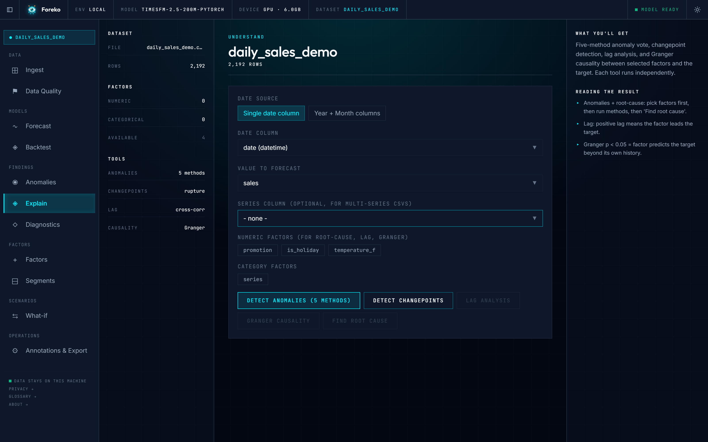</a>

**Explain**
<br/>
<sub>5-method anomaly vote, changepoints, lag analysis, Granger causality.</sub>

</td>
<td width="33%" align="center" valign="top">

<a href="docs/screenshots/09-factors-config.png">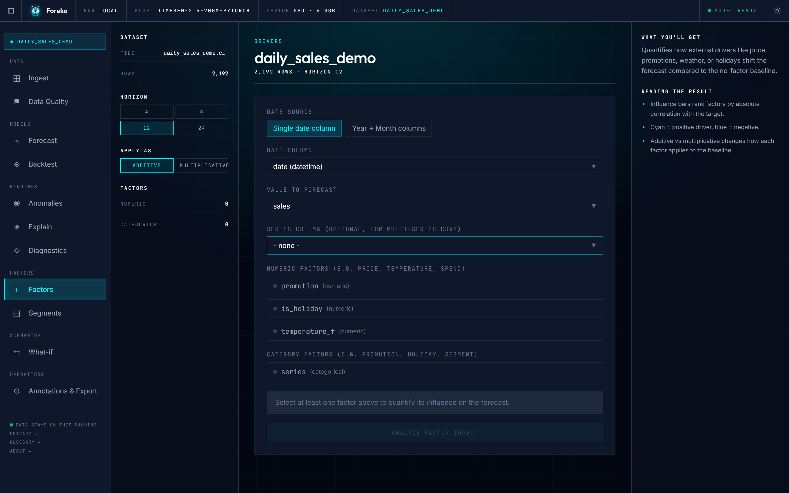</a>

**Factors**
<br/>
<sub>Price, promos, weather, holidays. Influence ranked, comparison charted.</sub>

</td>
<td width="33%" align="center" valign="top">

<a href="docs/screenshots/10-segments-config.png">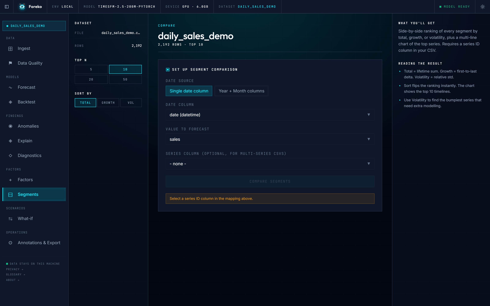</a>

**Segments**
<br/>
<sub>Multi-series side by side, ranked by total, growth, or volatility.</sub>

</td>
</tr>
<tr>
<td width="33%" align="center" valign="top">

<a href="docs/screenshots/11-scenarios-config.png">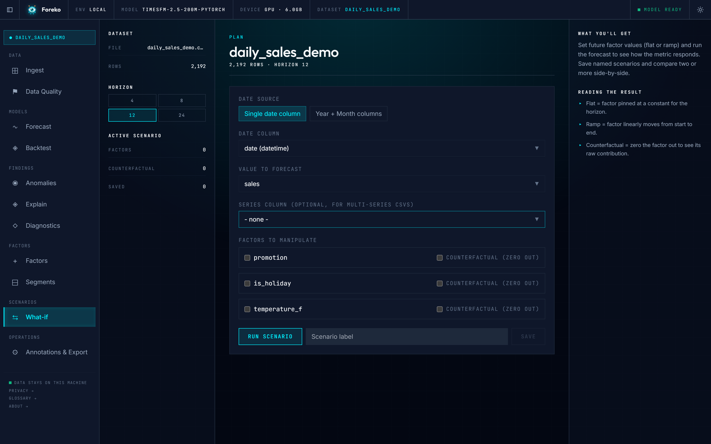</a>

**Scenarios**
<br/>
<sub>Pin factors flat, ramp them, zero them. Save and compare runs.</sub>

</td>
<td width="33%" align="center" valign="top">

<a href="docs/screenshots/12-operations.png">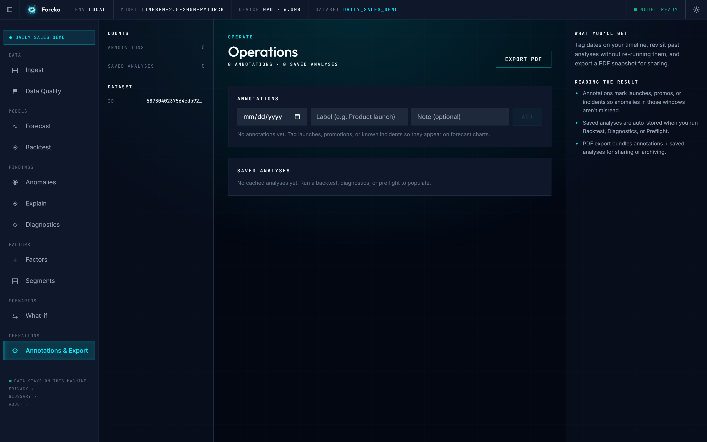</a>

**Operations**
<br/>
<sub>Tag launches and incidents, revisit cached runs, export a PDF briefing.</sub>

</td>
<td width="33%" align="center" valign="top">

<a href="docs/screenshots/13-glossary.png">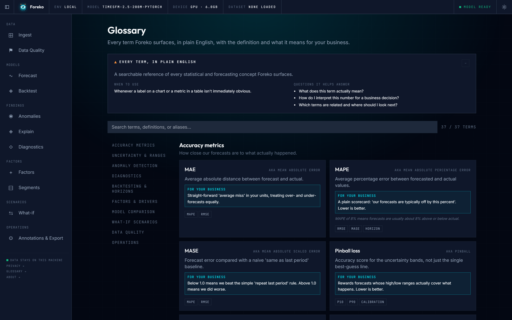</a>

**Glossary**
<br/>
<sub>Every stats term in plain English. Hover any Term tag to peek inline.</sub>

</td>
</tr>
</table>

---

## The models

<p align="center">
  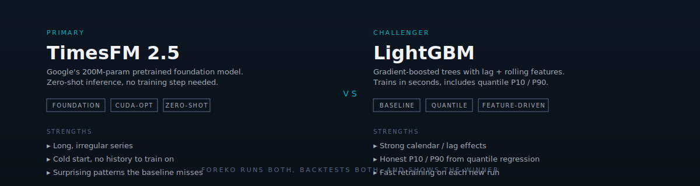
</p>

---

## Architecture

```mermaid
flowchart LR
  user([Browser<br/>:5173])
  api[FastAPI<br/>:8000]
  user -->|api/*| api

  subgraph services [Services]
    forecast[forecaster<br/>TimesFM]
    lgb[lightgbm_baseline<br/>quantile P10/P90]
    classical[classical<br/>ETS · naive]
    diag[diagnostics<br/>residuals · ACF · STL]
    anomaly[anomaly_methods<br/>5-method vote]
    factor[factor_diagnostics<br/>lag · Granger]
    exports[exports<br/>ReportLab PDF]
  end

  subgraph storage [~/.foreko]
    datasets[(datasets/)]
    models[(models/<br/>TimesFM weights)]
    db[(foreko.db<br/>SQLite)]
    out[(exports/)]
  end

  api --> services
  services --> storage

  classDef cyan fill:#00B8C9,stroke:#00B8C9,color:#0a1119,font-weight:600
  classDef neutral fill:#0d1722,stroke:#5a6c83,color:#A8B0BC
  classDef store fill:#0a1119,stroke:#1f2d3e,color:#5a6c83
  class user,api cyan
  class forecast,lgb,classical,diag,anomaly,factor,exports neutral
  class datasets,models,db,out store
```

---

## Stack

| Layer | Tech |
|---|---|
| Backend | FastAPI · Uvicorn · Python 3.10+ |
| Forecasting | TimesFM 2.5 (transformer) · LightGBM (with quantile regression) · ETS · seasonal-naive |
| Probabilistic | LightGBM `objective='quantile'` for P10/P90 · block-bootstrap residuals · prediction-interval calibration |
| Frontend | React 18 · Vite · TanStack Query · Zustand · Tailwind · Apache ECharts · Sonner |
| Storage | SQLite (annotations, saved analyses) · local filesystem (datasets, model cache, exports) |
| Connectors | SQLAlchemy · Postgres · MySQL · SQL Server · OS keyring for secrets |
| Reports | ReportLab in-process PDF |
| Tests | pytest (backend, ~120 tests) · Vitest + Testing Library (frontend) |

---

## Configuration

Every setting is overridable via `FOREKO_<FIELD>` environment variables.

| Variable | Default | Purpose |
|---|---|---|
| `FOREKO_MODEL_ID` | `google/timesfm-2.5-200m-pytorch` | HuggingFace model id |
| `FOREKO_STORAGE_DIR` | `~/.foreko` | Datasets, model cache, analyses, exports |
| `FOREKO_PRELOAD_MODEL` | `true` | Load weights at startup so the first forecast is instant |
| `FOREKO_MAX_UPLOAD_BYTES` | `52428800` | Hard cap on CSV upload size (50 MB) |
| `FOREKO_DATASET_TTL_HOURS` | `720` | When the janitor sweeps old uploads (30 days) |
| `FOREKO_CORS_ORIGINS` | dev origins | Allowed origins, comma-separated |
| `FOREKO_MAX_SQL_ROWS` | `5000000` | Hard cap on rows from a SQL ingest |

```bash
FOREKO_STORAGE_DIR=/tmp/foreko FOREKO_PRELOAD_MODEL=false \
  uv run uvicorn foreko.main:app --port 8000 --app-dir app/backend
```

---

## Repo layout

```
src/timesfm/                  TimesFM 2.5 model code (Apache 2.0, vendored)
app/backend/foreko/
  routers/                    HTTP endpoints, one file per concern
  services/                   forecaster, baselines, diagnostics, store, ...
  schemas/                    Pydantic request / response models
  jobs/                       async job manager + SSE
  main.py                     FastAPI app factory + lifespan
  settings.py                 env-driven config
app/backend/tests/            pytest suite (unit + integration markers)
app/frontend/
  src/pages/                  one file per UI page
  src/components/             chart components + shared primitives
  src/components/common/      Rails.tsx (3-rail layout), PageIntro, ...
  src/hooks/                  orchestrator hooks per page
  src/api/                    typed FastAPI client
  src/charts/theme.ts         centralised ECharts colours + tokens
docs/
  screenshots/                README screenshots, captured via Playwright
  svg/                        hand-drawn SVG diagrams
scripts/
  capture_screenshots.mjs     re-run to refresh the gallery
setup.ps1 / setup.sh          one-shot installers
.github/workflows/            CI
```

---

## Development

```bash
# Backend
uv run pytest app/backend/tests -q -m "not integration"   # fast unit pass
uv run pytest app/backend/tests -q -m integration         # runs with real model

# Frontend
cd app/frontend && npm test
cd app/frontend && npm run typecheck

# Production frontend (served by the backend at :8000)
cd app/frontend && npm run build

# Refresh README screenshots (with the dev servers running)
node scripts/capture_screenshots.mjs
```

---

## FAQ

<details>
<summary><b>Does Foreko send my data anywhere?</b></summary>
<br/>

No. The backend runs on your machine, the SPA talks to it on `localhost`,
and the only outbound request is the one-time TimesFM weights download
from the HuggingFace Hub. There is no telemetry, no analytics, no account.

</details>

<details>
<summary><b>Is the Windows installer different from the source app?</b></summary>
<br/>

No. The `.exe` installer is the same app wrapped for one-click install
(a Tauri shell plus the bundled backend, built from the `foreko-desktop`
repo). It runs locally, sends no data anywhere, and has no extra or paid
features. Use whichever path you prefer.

</details>

<details>
<summary><b>Can I use Foreko commercially?</b></summary>
<br/>

Yes. Apache 2.0 license. Build whatever you want on top. Foreko itself
will never have a paid tier.

</details>

<details>
<summary><b>Do I need a GPU?</b></summary>
<br/>

No. CPU mode works for every feature. A modern NVIDIA GPU (CUDA 12.8 +
driver `>= 570`) makes TimesFM inference noticeably faster on long
histories, but it is optional.

</details>

<details>
<summary><b>Why TimesFM AND LightGBM?</b></summary>
<br/>

TimesFM is a pretrained foundation model with strong zero-shot
performance, no training step. LightGBM trains in seconds on your data
and often wins when the series has explicit features like lags or
calendar effects. Running both and picking the winner on a holdout gives
you an honest answer.

</details>

<details>
<summary><b>Where do my files live?</b></summary>
<br/>

Under `~/.foreko/` by default. Override with `FOREKO_STORAGE_DIR`.

</details>

<details>
<summary><b>How do I share a forecast?</b></summary>
<br/>

Use the **Export PDF** button on Forecast, Backtest, Anomalies, or
Operations. The PDF is generated in-process by ReportLab and contains
the charts, metrics, and a written takeaway.

</details>

<details>
<summary><b>How do I add a new model?</b></summary>
<br/>

Drop a class with a `fit_and_forecast(...)` method into
`app/backend/foreko/services/`, register it in `comparison.py`, and add
a frontend toggle in `pages/BacktestPage.tsx`. Both backtest and the
forecast comparison will pick it up.

</details>

---

## License & attribution

<p align="left">
  <a href="LICENSE"></a>
</p>

Builds on:

- **TimesFM 2.5** (Google, Apache 2.0). See [`NOTICE`](NOTICE).
- PyTorch · Transformers · FastAPI · LightGBM · statsmodels · scikit-learn · React · Vite · Tailwind · ECharts.
- Full dependency attribution in [`NOTICE`](NOTICE).

---

<div align="center">

Built by [Mina Saad](https://github.com/MinaSaad1). No telemetry. No upsell.

<sub>Star the repo if you find it useful.</sub>

</div>
